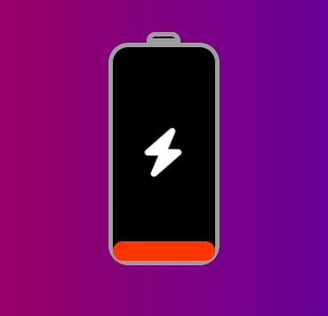
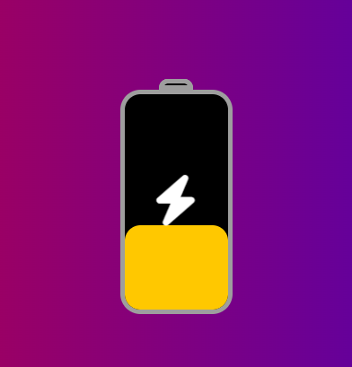
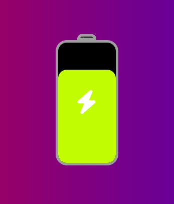
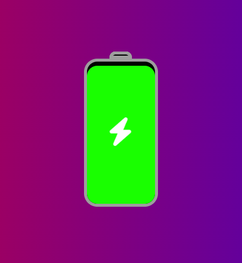

# 01. Proje - Batarya Dolum Animasyonu 

* Bu projemizde HTML5 ve CSS3 bilgilerimi kullanarak bir batarya sembolu oluşturdum ve oluşturduğum batarya içerisine Font Awesome'dan bir ikon ekledim. Animasyonumuz bataryanın dolumunu gösteren bir arka plan renklendirmesi ile eklediğimiz ikonun büyüyüp küçülmesini sağlayan yapıyı oluşturdum. Şimdi gelin beraber neler yaptım. Adım adım bakalım.

* İlk olarak Font Awesome'dan bir ikon kullandığım için Font Awesome sitesinden kullandığım ikonu seçebilmem için HTML sayfamın head bölümünde sayfanın bağlantı etiketini ve CSS komutlarını HTML sayfamda çalışması için style.css dosyamı ekledim.

~~~ HTML
<link rel="stylesheet" href="https://cdnjs.cloudflare.com/ajax/libs/font-awesome/6.2.1/css/all.min.css" integrity="sha512-MV7K8+ +gLIBoVD59lQIYicR65iaqukzvf/nwasF0nqhPay5w/9lJmVM2hMDcnK1OnMGCdVK+iQrJ7lzPJQd1w==" crossorigin="anonymous" referrerpolicy="no-referrer"/>
<link rel="stylesheet" href="style.css">
~~~

* Daha sonra HTML sayfamın body kısmında batarya sembolünü oluşturdum. Bataryamız iki bölümden oluşuyor. Birinci bölüm head kısmı, ikinci kısmı body kısmıdır. Bataryanın body kısmı yine iki kısma ayrılıyor. Birincisi bataryanın body kısmının üzerinde ikonu tutması için, ikinci kısmı ise bataryanın dolduğunu gösterebilmesi için arka plan renklendirmesi içindir.

~~~ HTML

    

    

        <i class="fas fa-bolt"></i>
        

    

~~~

* Böylelikle HTML sayfamızdaki işlemlerimiz bitti. Şimdi gelelim CSS dosyamıza...

* İlk olarak CSS dosyamızda body etiketine stillendirme işlemlerini inceleyerek başlayalım. body etiketini ilk olarak genişlik ve yükseklik verildi. Daha sonrasında bataryamızın sayfanın tam ortasında görünmesi için flex özelliği kullanıldı. Daha sonrasında bir arka plan renklendirmesi yapıldı.

~~~ CSS
body {
    width: 100%;
    min-height: 100vh;
    display: flex;
    justify-content: center;
    align-items: center;
    background: linear-gradient(90deg, #ff0000, #0000ff);
}
~~~

* Bataryamızın uç (head) kısmını oluşturmak için genişlik ve yükseklik verildi. Bataryanın uç (head) kısmını daha belirgin bir şekilde görebilmek için bir kenarlık verildi ve üst kenarları ovalleştirildi. Son olarak bir arka plan rengi verildi. Sağdan ve soldan ortalanması sağlandı. 

~~~ CSS
.battery-head {
    width: 30px;
    height: 10px;
    margin: 0 auto;
    border: 4px solid #9e9e9e;
    border-top-left-radius: 8px;
    border-top-right-radius: 8px;
    background-color: #000;
}
~~~

* Bataryamızın vücut (body) kısmını oluşturmak için genişlik ve yükseklik verildi. Daha sonra body kısmının daha belirgin olması için bir kenarlık verildi ve bu kenarlar tüm köşelerinden ovalleştirildi. Arka plan renklendirmesi yapıldı. Sağdan ve soldan ortalanması sağlandı. Son olarak position özelliğini relative yaptık. Bu özellik sayesinde body kısmı içerisinde ikonumuzu ve arka plan renklendirmesini istediğimiz konuma getirebileceğiz.

~~~ CSS
.battery-body {
    width: 100px;
    height: 200px;
    margin: 0 auto;
    border: 4px solid #9e9e9e;
    border-radius: 18px;
    background-color: #000;
    position: relative;
}
~~~

* İkonun rengi ve boyutu tanımlandı ve body kısmında konumlandırılması yapıldı. Son olarak ikona bir animasyon eklendi. Bu animasyonu keyframes ile tanımladık. Animasyonumuz ikonumuzun büyüyüp küçülmesini sağladı.

~~~ CSS
.battery-body i {
    color: #fff;
    font-size: 36px;
    z-index: 99;
    position: absolute;
    top: 40%;
    left: 33%;
    animation: battery-bolt 2s linear infinite;
}

@keyframes battery-bolt {
    50% {
        transform: scale(1.3);
    }
    100% {
        transform: scale(1.0);
    }
}
~~~

* Arka plan renklendirmesinin başlangıç konumu yani alt kısımdan üst kısıma doğru olacak şekilde tanımlandı. Daha sonrasında bataryanın body kısmının tamamını kapsaması için genişlik %100 olarak verildi ve kenarlarında taşma olmaması için ovalleştirme işlemi yapıldı. Son olarak bir animasyon tanımlandı. Animasyonumuz keyframes ile tanımladık. Animasyonumuzda her yükseklik için belli bir arka plan renklendirmesi yapıldı.

~~~ CSS
.battery-body .battery-charge {
    width: 100%;
    border-radius: 14px;
    position: absolute;
    bottom: 0;
    animation: battery-charge 8s linear infinite;
}

@keyframes battery-charge {
    0% {
        height: 0;
        background-color: #ff0000;
    }
    25% {
        height: 25%;
        background-color: #ff9100;
    }
    50% {
        height: 50%;
        background-color: #fff200;;
    }
    75% {
        height: 75%;
        background-color: #d7fc03;
    }
    100% {
        height: 100%;
        background-color: #00ff00;
    }
}
~~~ 

## Batarya Dolum Animasyonu Fotoğrafları

    
    
    
    

## Batarya Dolum Animasyonunun Video Tanıtım Bağlantısı

* Video bağlantısı için <a href="https://www.youtube.com/watch?v=onCjJP5Hmyk">tıklayınız</a>.
